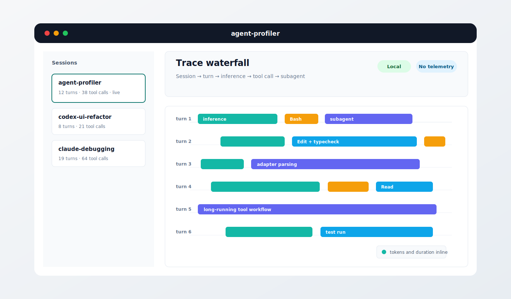

<p align="center"><code>npx @ghostship/agent-profiler</code><br />or <code>npm i -g @ghostship/agent-profiler</code></p>
<p align="center"><strong>agent-profiler</strong> is a local, open-source trace viewer for agent harness sessions.</p>
<p align="center"><strong>Supported harnesses:</strong> Codex and Claude Code</p>
<p align="center">
  
</p>

---

## Quickstart

### Installing and running agent-profiler

agent-profiler runs entirely on your computer. It reads local harness transcripts on demand, serves a local UI, and does not upload traces, prompts, tool output, or usage data anywhere.

Requirements:

- **Node.js 20+**
- **npm 10+**
- Local transcript data from Codex or Claude Code

Run with `npx`:

```shell
npx @ghostship/agent-profiler
```

Or install globally:

```shell
npm install -g @ghostship/agent-profiler
agent-profiler
```

The app opens `http://localhost:5173/` by default.

### Using local harness data

agent-profiler is deliberately local-first:

- No hooks or background collector.
- No hosted service or telemetry.
- No data leaves your computer.
- The server only reads local transcript files when the UI requests them.

The Claude Code adapter reads session transcripts from `~/.claude/projects/*/`. Codex support follows the same adapter model: discover local session files, parse them into the shared trace shape, and render them in the same waterfall UI.

### CLI options

```shell
agent-profiler [options]

  -p, --port <n>     Port to listen on (0 = pick a free one). Default 5173
      --no-open      Do not open a browser tab
  -v, --verbose      Log every HTTP request to stderr
  -V, --version      Print version and exit
  -h, --help         Show this message
```

### Developing locally

```shell
git clone https://github.com/devonperoutky/agent-profiler
cd agent-profiler
npm install
npm run dev
```

Common commands:

```shell
npm run build        # builds ui/dist/
npm run test         # node:test unit + smoke tests
npm run typecheck    # tsc --noEmit
npm run lint         # biome check
```

## Docs

- [**Architecture**](./ARCHITECTURE.md)
- [**Contributing**](./CONTRIBUTING.md)
- [**Documentation Stub: Adding an adapter for a new agent harness**](./docs/adding-agent-harness-adapter.md)

This repository is licensed under the [Apache-2.0 License](./LICENSE).
